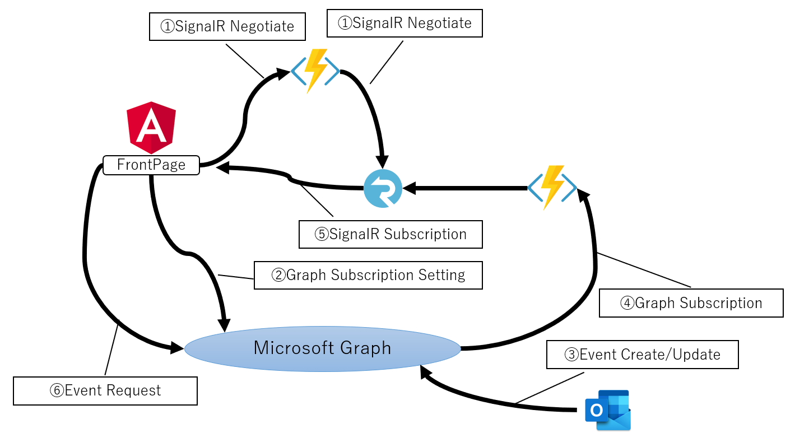

# このリポジトリについて

2020年04月の.NETラボで使用したデモアプリケーションのリソースです。

MicrosoftGraphのSubscriptionとAzure Functions、SignalRを使用しています。

Outlookなどで予定情報が追加/更新された際に、FrontのWebページで通知する。といったデモです。

👇図のようなフローとなります。

1. FrontでSignalRの接続を確立し、SignalRからの通知を受け取れるようにします
2. Micorosft GraphのSubscriptionを設定します
3. Outlookなどで予定を作成/更新します
4. GraphのWebFookでFunctionsのWebAPIが叩かれます
5. FunctionsからSignalR、Frontに通知されます
6. 通知の中に格納されるイベント情報などを使用してMicorosftGraphのイベント情報を取得します

2020年4月時点のデモとなります。

参照されたタイミングによっては、Azure/Angularの仕様変更により動作しない可能性がありますのでご留意くださいませ。